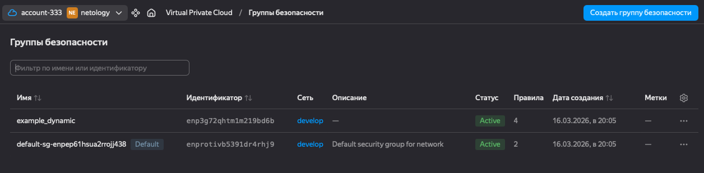
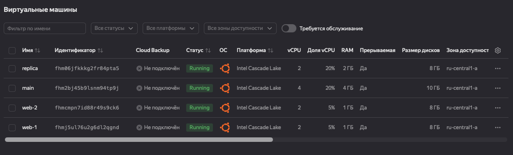
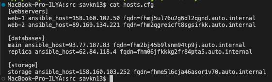

# Домашнее задание к занятию «Управляющие конструкции в коде Terraform»

---

## Задание 1 — Группы безопасности

Изучен проект, инициализирован и выполнен код. Создана группа безопасности `example_dynamic` с динамическими правилами через блок `dynamic`.

Входящие правила (ingress):
- TCP порт 22 — SSH
- TCP порт 80 — HTTP
- TCP порт 443 — HTTPS

Исходящие правила (egress):
- TCP 0–65365 — весь исходящий трафик



---

## Задание 2 — count и for_each

### count-vm.tf — две одинаковые ВМ web-1 и web-2

```hcl
data "yandex_compute_image" "ubuntu_count" {
  family = "ubuntu-2004-lts"
}

resource "yandex_compute_instance" "web" {
  count       = 2
  name        = "web-${count.index + 1}"
  platform_id = "standard-v2"
  zone        = var.default_zone

  depends_on = [yandex_compute_instance.db]

  resources {
    cores         = 2
    memory        = 1
    core_fraction = 5
  }
  boot_disk {
    initialize_params {
      image_id = data.yandex_compute_image.ubuntu_count.image_id
      size     = 8
    }
  }
  scheduling_policy {
    preemptible = true
  }
  network_interface {
    subnet_id          = yandex_vpc_subnet.develop.id
    nat                = true
    security_group_ids = [yandex_vpc_security_group.example.id]
  }
  metadata = {
    serial-port-enable = 1
    ssh-keys           = "ubuntu:${local.ssh_key}"
  }
}
```

### for_each-vm.tf — ВМ main и replica с разными параметрами

```hcl
variable "each_vm" {
  type = list(object({
    vm_name     = string
    cpu         = number
    ram         = number
    disk_volume = number
  }))
  default = [
    {
      vm_name     = "main"
      cpu         = 4
      ram         = 4
      disk_volume = 10
    },
    {
      vm_name     = "replica"
      cpu         = 2
      ram         = 2
      disk_volume = 8
    }
  ]
}

resource "yandex_compute_instance" "db" {
  for_each    = { for vm in var.each_vm : vm.vm_name => vm }
  name        = each.value.vm_name
  platform_id = "standard-v2"
  zone        = var.default_zone

  resources {
    cores         = each.value.cpu
    memory        = each.value.ram
    core_fraction = 20
  }
  boot_disk {
    initialize_params {
      image_id = data.yandex_compute_image.ubuntu_each.image_id
      size     = each.value.disk_volume
    }
  }
  scheduling_policy {
    preemptible = true
  }
  network_interface {
    subnet_id          = yandex_vpc_subnet.develop.id
    nat                = true
    security_group_ids = [yandex_vpc_security_group.example.id]
  }
  metadata = {
    serial-port-enable = 1
    ssh-keys           = "ubuntu:${local.ssh_key}"
  }
}
```

### locals.tf — считывание SSH-ключа через функцию file

```hcl
locals {
  ssh_key = file("~/.ssh/id_ed25519.pub")
}
```

### Порядок создания

ВМ из `count` (web-1, web-2) создаются после ВМ из `for_each` (main, replica) благодаря `depends_on = [yandex_compute_instance.db]`.



---

## Задание 3 — Диски и dynamic блок

### disk_vm.tf

```hcl
resource "yandex_compute_disk" "storage" {
  count = 3
  name  = "disk-${count.index + 1}"
  size  = 1
  zone  = var.default_zone
}

resource "yandex_compute_instance" "storage" {
  name        = "storage"
  platform_id = "standard-v2"
  zone        = var.default_zone

  resources {
    cores         = 2
    memory        = 1
    core_fraction = 5
  }
  boot_disk {
    initialize_params {
      image_id = data.yandex_compute_image.ubuntu_storage.image_id
      size     = 8
    }
  }
  dynamic "secondary_disk" {
    for_each = yandex_compute_disk.storage
    content {
      disk_id = secondary_disk.value.id
    }
  }
  scheduling_policy {
    preemptible = true
  }
  network_interface {
    subnet_id          = yandex_vpc_subnet.develop.id
    nat                = true
    security_group_ids = [yandex_vpc_security_group.example.id]
  }
  metadata = {
    serial-port-enable = 1
    ssh-keys           = "ubuntu:${local.ssh_key}"
  }
}
```

Три диска созданы через `count`, подключены к ВМ через `dynamic "secondary_disk"` с `for_each` по списку дисков.

---

## Задание 4 — Ansible inventory через templatefile

### hosts.tftpl

```
[webservers]
%{ for i in webservers ~}
${i["name"]} ansible_host=${i["network_interface"][0]["nat_ip_address"]} fqdn=${i["fqdn"]}
%{ endfor ~}

[databases]
%{ for i in databases ~}
${i["name"]} ansible_host=${i["network_interface"][0]["nat_ip_address"]} fqdn=${i["fqdn"]}
%{ endfor ~}

[storage]
%{ for i in storage ~}
${i["name"]} ansible_host=${i["network_interface"][0]["nat_ip_address"]} fqdn=${i["fqdn"]}
%{ endfor ~}
```

### ansible.tf

```hcl
resource "local_file" "hosts_cfg" {
  content = templatefile("${path.module}/hosts.tftpl",
    {
      webservers = yandex_compute_instance.web
      databases  = yandex_compute_instance.db
      storage    = [yandex_compute_instance.storage]
    }
  )
  filename = "${path.module}/hosts.cfg"
}
```

### Результат — файл hosts.cfg

```
[webservers]
web-1 ansible_host=158.160.102.50 fqdn=fhmj5ul76u2g6dl2qgnd.auto.internal
web-2 ansible_host=89.169.134.221 fqdn=fhm2qgreicft8sgsirkk.auto.internal

[databases]
main ansible_host=93.77.187.83 fqdn=fhm2bj45b9lsnm94tp9j.auto.internal
replica ansible_host=62.84.118.4 fqdn=fhm06jfkkkg2fr84pta5.auto.internal

[storage]
storage ansible_host=158.160.103.252 fqdn=fhme5l6cja46asor1v70.auto.internal
```



---

## Удаление ресурсов

После выполнения всех заданий ресурсы удалены командой `terraform destroy`.
